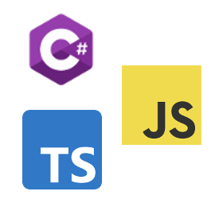
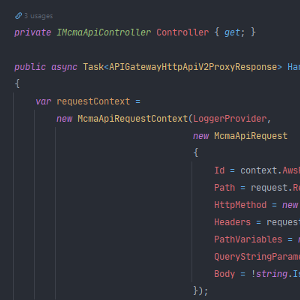
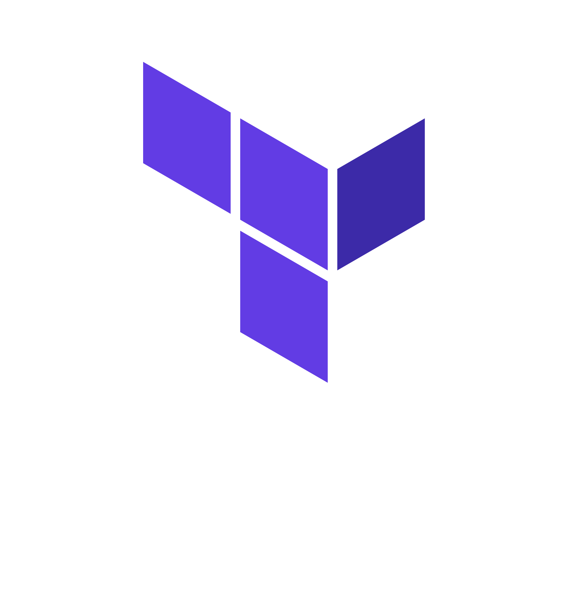

<main>
  

    

    

      
      

        <button type="button" class="btn btn-primary">Get Started</button>
        <button type="button" class="btn btn-secondary">How It Works</button>
      

    

  

  

    

      <i class="glyphicon glyphicon-film"></i>
      <section class="right">
        <h2>Built for Media</h2>
        
MCMA is built with media in mind. Build complex workflows with long-running tasks to transform your media, extract metadata, and move it around the world.

      </section>
    

    

      <section class="left">
        <h2>Choose Your Cloud</h2>
        
MCMA uses patterns that are cloud-agnostic, with out-of-the-box support for the three biggest cloud providers today: AWS, Azure, and Google Cloud.

      </section>
      
    

    

      
      <section class="right">
        <h2>Choose Your Language</h2>
        
MCMA provides libraries for some of the most popular programming languages today (with more on the way!). Build your services for Node.js platforms using TypeScript or JavaScript, or for .NET using C#.

      </section>
    

    

      <section class="left">
        <h2>Focus on Your Code</h2>
        
MCMA is built with an emphasis on serverless platforms, particularly FaaS (Function as a Service). Deploy your code without worrying about the servers it's running on.

      </section>
      
    

    

      
      <section class="right">
        <h2>Deploy Anywhere</h2>
        
MCMA uses <a href="https://terraform.io">Terraform</a>, an open-source tool for provisioning and managing infrastructure and resources across dozens of cloud and on-premise providers.

      </section>
    

  

</main>